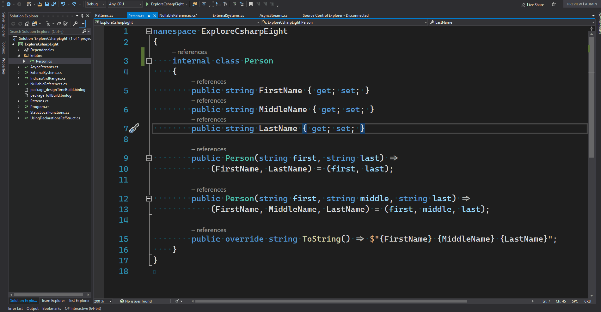
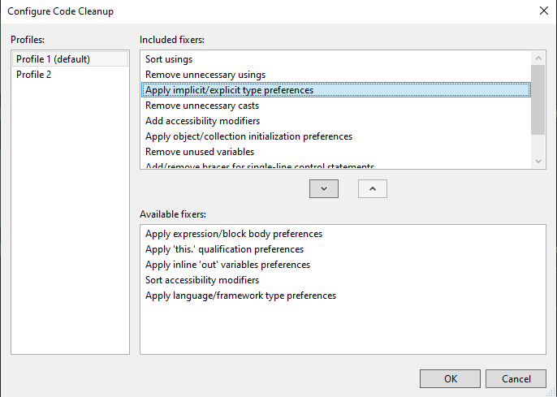

# Pinnacle Coding Convention
This project is about to ensure and automate some coding conventions in the Pinnacle solution. 
It helps developers to avoid some tedious NW in code review, e.g. A-Z order, missing regions, regions not matched...

## Build

## Release 

### 1.1.8
- Do not add regions, and remove existing regions.
- Group by sections:
    - Constants
    - Fields
    - Constructors
    - Methods
    - Properties

### 1.1.5
Change to not get Clipboard involved when formatting in an attempt to fix the exception: 
`System.Runtime.InteropServices.COMException (0x800401D0): OpenClipboard Failed (Exception from HRESULT: 0x800401D0 (CLIPBRD_E_CANT_OPEN))`
### 1.1.2
Add ability to Run Code Cleanup (Profile) feature from Visual Studio 2019. Be able to config which Profile to execute through option: Tools > Options > Pinnacle Coding Convention > General > Profile

Some functionalities from Cleanup Profile:
- Sort usings
- Remove Unnecessary usings
- Apply implicit/explicit preferences
- Remove unused variable

